R for Biologist - An Introduction to R (Lecture 1)
========================================================

What is R
--------------------------------------------------------
R is a language and environment for statistical computing and graphics. It provides a wide variety of statistical and graphical techniques (linear and nonlinear modelling, statistical tests, time series analysis, classification, clustering, ...)  and graphical techniques, and is highly extensible. It is a GNU project (Free and Open Source) which is similar to the S language and environment which was developed at Bell Laboratories (formerly AT&T, now Lucent Technologies) by John Chambers and colleagues. R was created by Ross Ihaka and Robert Gentleman[4] at the University of Auckland, New Zealand, and now, R is developed by the R Development Core Team, of which Chambers is a member. R is named partly after the first names of the first two R authors (Robert Gentleman and Ross Ihaka), and partly as a play on the name of S. R can be considered as a different implementation of S. There are some important differences, but much code written for S runs unaltered under R. 

Some of R's strengths:
* The ease with which well-designed publication-quality plots can be produced, including mathematical symbols and formulae where needed. Great care has been taken over the defaults for the minor design choices in graphics, but the user retains full control.
* It compiles and runs on a wide variety of UNIX platforms and similar systems (including FreeBSD and Linux), Windows and MacOS.
* R can be extended (easily) via packages.
* R has its own LaTeX-like documentation format, which is used to supply comprehensive documentation, both on-line in a number of formats and in hardcopy.
* Its FREE!

### When to use R - R or Python
Both R and Python are full featured languages and in most applications are completly overlapping, meaning you can choose to use either one, if your willing to write your own code. The better question is when is it easiest to use one or the other and when are there already tools available to use in one language or the other. 

My opinion is, R is best when you're doing data analysis tasks, or modeling tasks. Visualizing, summarizing, subsetting, filtering, sampling, measuring - all of these things can be done with R programmatically as well as on an ad-hoc basis. Python has some tools for this  - [panas](http://pandas.pydata.org/) - but its not quite there yet.

R is most limited when you can perform a task line by line without reading in the whole dataset.

### The R environment
R is an integrated suite of software facilities for data manipulation, calculation and graphical display. It includes

* an effective data handling and storage facility,
* a suite of operators for calculations on arrays, in particular matrices,
* a large, coherent, integrated collection of intermediate tools for data analysis,
* graphical facilities for data analysis and display either on-screen or on hardcopy, and
* a well-developed, simple and effective programming language which includes conditionals, loops, user-defined recursive functions and input and output facilities.

The term "environment" is intended to characterize it as a fully planned and coherent system, rather than an incremental accretion of very specific and inflexible tools, as is frequently the case with other data analysis software.

R, like S, is designed around a true computer language, and it allows users to add additional functionality by defining new functions. Much of the system is itself written in the R dialect of S, which makes it easy for users to follow the algorithmic choices made. For computationally-intensive tasks, C, C++ and Fortran code can be linked and called at run time. Advanced users can write C code to manipulate R objects directly.

Many users think of R as a statistics system. The R group, prefers to think of it of an environment within which statistical techniques are implemented.

The R Homepage
--------------------------------------
The R homepage has a wealth of information on it,

[R-project.org](http://r-project.org/)

On the homepage you can:
* Learn more about R
* Download R
* Get Documentation (official and user supplied)
* Get access to CRAN 'Comprehensive R archival network'


RStudio
--------------------------------------

Relatively new project that is the BEST integrated developement environment I have ever used.

[RStudio](http://rstudio.org/)

RStudio has many features:
* syntax highlighting
* code completion
* smart indentation
* "Projects"
* workspace browser and data viewer
* imbedded plots
* Sweave authoring and knitr with one click pdf or html
* runs on all platforms and over the web


An introduction to an R session
====================================================

The following session is intended to introduce to you some features of the R environment by using them. Many features of the system will be unfamiliar and puzzling at first, but this puzzlement will soon disappear.

Start the HTML interface to on-line help (in RStudio, or using a web browser available at your machine).

```r
help.start()
```


Generate two pseudo-random normal vectors of x- and y-coordinates. 

```r
x <- rnorm(50)
y <- rnorm(x)
```


Plot the points in the plane. A graphics window will appear automatically. 

```r
plot(x, y)
```

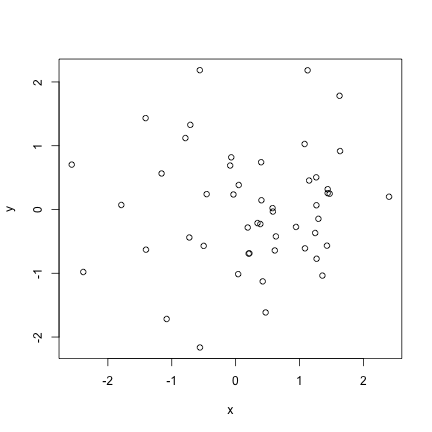 


See which R objects are now in the R workspace. 

```r
ls()
```

```
## [1] "x" "y"
```


Remove objects no longer needed. (Clean up). 

```r
rm(x, y)
```


Make x = (1, 2, ..., 20). 

```r
x <- 1:20
```


A `weight' vector of standard deviations. 

```r
w <- 1 + sqrt(x)/2
```


Make a data frame of two columns, x and y, and look at it. 

```r
dummy <- data.frame(x = x, y = x + rnorm(x) * w)
dummy
```

```
##     x      y
## 1   1  2.702
## 2   2  1.624
## 3   3  1.490
## 4   4  5.493
## 5   5  8.276
## 6   6  8.168
## 7   7  8.131
## 8   8 10.159
## 9   9 12.938
## 10 10 14.078
## 11 11  7.527
## 12 12 15.598
## 13 13 12.500
## 14 14 14.190
## 15 15 13.778
## 16 16 16.856
## 17 17 20.848
## 18 18 16.695
## 19 19 18.603
## 20 20 18.876
```


Fit a simple linear regression and look at the analysis. With y to the left of the tilde, we are modelling y dependent on x. 

```r
fm <- lm(y ~ x, data = dummy)
summary(fm)
```

```
## 
## Call:
## lm(formula = y ~ x, data = dummy)
## 
## Residuals:
##    Min     1Q Median     3Q    Max 
## -4.360 -1.379 -0.028  1.253  3.439 
## 
## Coefficients:
##             Estimate Std. Error t value Pr(>|t|)    
## (Intercept)   1.7629     1.0102    1.75    0.098 .  
## x             0.9203     0.0843   10.91  2.3e-09 ***
## ---
## Signif. codes:  0 '***' 0.001 '**' 0.01 '*' 0.05 '.' 0.1 ' ' 1 
## 
## Residual standard error: 2.17 on 18 degrees of freedom
## Multiple R-squared: 0.869,	Adjusted R-squared: 0.861 
## F-statistic:  119 on 1 and 18 DF,  p-value: 2.29e-09
```


Since we know the standard deviations, we can do a weighted regression. 

```r
fm1 <- lm(y ~ x, data = dummy, weight = 1/w^2)
summary(fm1)
```

```
## 
## Call:
## lm(formula = y ~ x, data = dummy, weights = 1/w^2)
## 
## Weighted Residuals:
##     Min      1Q  Median      3Q     Max 
## -1.6415 -0.5428  0.0449  0.6182  1.2205 
## 
## Coefficients:
##             Estimate Std. Error t value Pr(>|t|)    
## (Intercept)   1.3056     0.7910    1.65     0.12    
## x             0.9623     0.0807   11.93  5.5e-10 ***
## ---
## Signif. codes:  0 '***' 0.001 '**' 0.01 '*' 0.05 '.' 0.1 ' ' 1 
## 
## Residual standard error: 0.874 on 18 degrees of freedom
## Multiple R-squared: 0.888,	Adjusted R-squared: 0.882 
## F-statistic:  142 on 1 and 18 DF,  p-value: 5.54e-10
```


Make the columns in the data frame visible as variables. 

```r
attach(dummy)
```

```
## The following object(s) are masked _by_ '.GlobalEnv':
## 
##     x
```


Make a nonparametric local regression function. 

```r
lrf <- lowess(x, y)
```


```r
# Standard point plot.
plot(x, y)
# Add in the local regression.
lines(x, lrf$y)
# The true regression line: (intercept 0, slope 1).
abline(0, 1, lty = 3)
# Unweighted regression line.
abline(coef(fm), col = "blue")
# Weighted regression line.
abline(coef(fm1), col = "red")
```

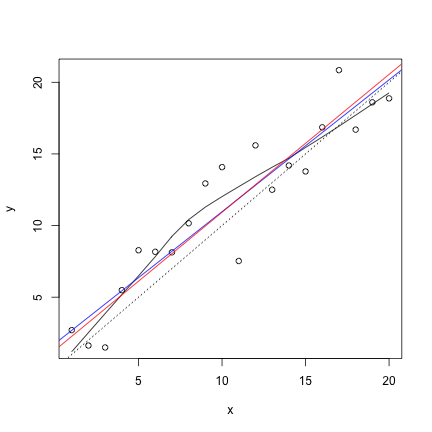 


Remove data frame from the search path. 

```r
detach()
```


A standard regression diagnostic plot to check for heteroscedasticity. Can you see it? 

```r
plot(fitted(fm), resid(fm), xlab = "Fitted values", ylab = "Residuals", main = "Residuals vs Fitted")
```

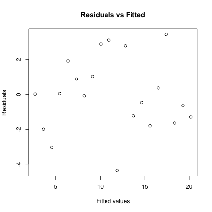 


A normal scores plot to check for skewness, kurtosis and outliers. (Not very useful here.) 

```r
qqnorm(resid(fm), main = "Residuals Rankit Plot")
```

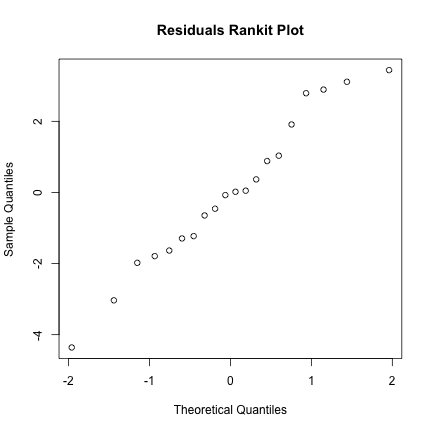 


Clean up again.

```r
rm(fm, fm1, lrf, x, dummy)
```


The next section will look at data from the classical experiment of Michelson to measure the speed of light. This dataset is available in the morley object, but we will read it to illustrate the read.table function.

Get the path to the data file. 

```r
filepath <- system.file("data", "morley.tab", package = "datasets")
filepath
```

```
## [1] "/Library/Frameworks/R.framework/Resources/library/datasets/data/morley.tab"
```


Optional. Look at the file. 

```r
file.show(filepath)
```


Read in the Michelson data as a data frame, and look at it. There are five experiments (column Expt) and each has 20 runs (column Run) and sl is the recorded speed of light, suitably coded. 

```r
mm <- read.table(filepath)
mm
```

```
##     Expt Run Speed
## 001    1   1   850
## 002    1   2   740
## 003    1   3   900
## 004    1   4  1070
## 005    1   5   930
## 006    1   6   850
## 007    1   7   950
## 008    1   8   980
## 009    1   9   980
## 010    1  10   880
## 011    1  11  1000
## 012    1  12   980
## 013    1  13   930
## 014    1  14   650
## 015    1  15   760
## 016    1  16   810
## 017    1  17  1000
## 018    1  18  1000
## 019    1  19   960
## 020    1  20   960
## 021    2   1   960
## 022    2   2   940
## 023    2   3   960
## 024    2   4   940
## 025    2   5   880
## 026    2   6   800
## 027    2   7   850
## 028    2   8   880
## 029    2   9   900
## 030    2  10   840
## 031    2  11   830
## 032    2  12   790
## 033    2  13   810
## 034    2  14   880
## 035    2  15   880
## 036    2  16   830
## 037    2  17   800
## 038    2  18   790
## 039    2  19   760
## 040    2  20   800
## 041    3   1   880
## 042    3   2   880
## 043    3   3   880
## 044    3   4   860
## 045    3   5   720
## 046    3   6   720
## 047    3   7   620
## 048    3   8   860
## 049    3   9   970
## 050    3  10   950
## 051    3  11   880
## 052    3  12   910
## 053    3  13   850
## 054    3  14   870
## 055    3  15   840
## 056    3  16   840
## 057    3  17   850
## 058    3  18   840
## 059    3  19   840
## 060    3  20   840
## 061    4   1   890
## 062    4   2   810
## 063    4   3   810
## 064    4   4   820
## 065    4   5   800
## 066    4   6   770
## 067    4   7   760
## 068    4   8   740
## 069    4   9   750
## 070    4  10   760
## 071    4  11   910
## 072    4  12   920
## 073    4  13   890
## 074    4  14   860
## 075    4  15   880
## 076    4  16   720
## 077    4  17   840
## 078    4  18   850
## 079    4  19   850
## 080    4  20   780
## 081    5   1   890
## 082    5   2   840
## 083    5   3   780
## 084    5   4   810
## 085    5   5   760
## 086    5   6   810
## 087    5   7   790
## 088    5   8   810
## 089    5   9   820
## 090    5  10   850
## 091    5  11   870
## 092    5  12   870
## 093    5  13   810
## 094    5  14   740
## 095    5  15   810
## 096    5  16   940
## 097    5  17   950
## 098    5  18   800
## 099    5  19   810
## 100    5  20   870
```


Change Expt and Run into factors. 

```r
mm$Expt <- factor(mm$Expt)
mm$Run <- factor(mm$Run)
```


Make the data frame visible at position 3 (the default). 

```r
attach(mm)
```


Compare the five experiments with simple boxplots. 

```r
plot(Expt, Speed, main = "Speed of Light Data", xlab = "Experiment No.")
```

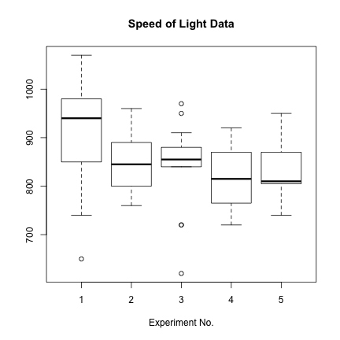 


Analyze as a randomized block, with `runs' and `experiments' as factors. 

```r
fm <- aov(Speed ~ Run + Expt, data = mm)
summary(fm)
```

```
##             Df Sum Sq Mean Sq F value Pr(>F)   
## Run         19 113344    5965    1.11 0.3632   
## Expt         4  94514   23629    4.38 0.0031 **
## Residuals   76 410166    5397                  
## ---
## Signif. codes:  0 '***' 0.001 '**' 0.01 '*' 0.05 '.' 0.1 ' ' 1
```


Fit the sub-model omitting `runs', and compare using a formal analysis of variance. 

```r
fm0 <- update(fm, . ~ . - Run)
anova(fm0, fm)
```

```
## Analysis of Variance Table
## 
## Model 1: Speed ~ Expt
## Model 2: Speed ~ Run + Expt
##   Res.Df    RSS Df Sum of Sq    F Pr(>F)
## 1     95 523510                         
## 2     76 410166 19    113344 1.11   0.36
```


Clean up before moving on.

```r
detach()
rm(fm, fm0)
```


We now look at some more graphical features: contour and image plots.

x is a vector of 50 equally spaced values in the interval [-pi\, pi]. y is the same. 

```r
x <- seq(-pi, pi, len = 50)
y <- x
```


f is a square matrix, with rows and columns indexed by x and y respectively, of values of the function cos(y)/(1 + x^2). 

```r
f <- outer(x, y, function(x, y) cos(y)/(1 + x^2))
```


Save the plotting parameters and set the plotting region to “square”. 

```r
oldpar <- par(no.readonly = TRUE)
par(pty = "s")
```


Make a contour map of f; add in more lines for more detail. 

```r
contour(x, y, f)
contour(x, y, f, nlevels = 15, add = TRUE)
```

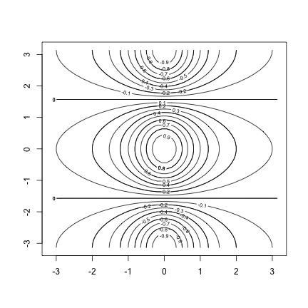 


fa is the “asymmetric part” of f. (t() is transpose). 

```r
fa <- (f - t(f))/2
```


Make a contour plot, ... 

```r
contour(x, y, fa, nlevels = 15)
```

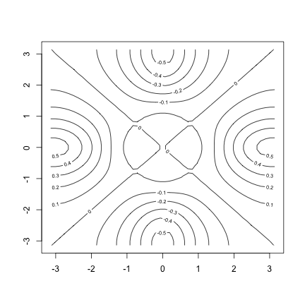 


... and restore the old graphics parameters. 

```r
par(oldpar)
```


Make some high density image plots,


```r
image(x, y, f)
```

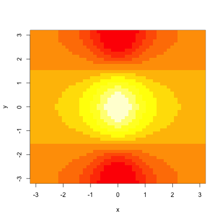 

```r
image(x, y, fa)
```

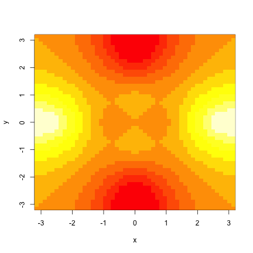 


... and clean up before moving on.

```r
objects()
```

```
## [1] "f"        "fa"       "filepath" "mm"       "oldpar"   "w"       
## [7] "x"        "y"
```

```r
rm(x, y, f, fa)
```


R can do complex arithmetic, also.

```r
th <- seq(-pi, pi, len = 100)
# 1i is used for the complex number i.
z <- exp((0+1i) * th)
```


Plotting complex arguments means plot imaginary versus real parts. This should be a circle. 

```r
par(pty = "s")
plot(z, type = "l")
```

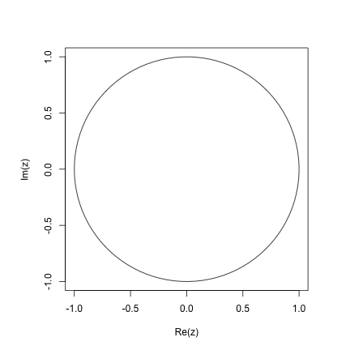 


Suppose we want to sample points within the unit circle. One method would be to take complex numbers with standard normal real and imaginary parts ... 

```r
w <- rnorm(100) + rnorm(100) * (0+1i)
```


... and to map any outside the circle onto their reciprocal. 

```r
w <- ifelse(Mod(w) > 1, 1/w, w)
```


```r
plot(w, xlim = c(-1, 1), ylim = c(-1, 1), pch = "+", xlab = "x", ylab = "y")
# All points are inside the unit circle, but the distribution is not
# uniform.
lines(z)
```

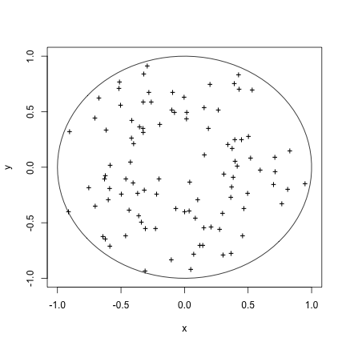 


The second method uses the uniform distribution. The points should now look more evenly spaced over the disc. 

```r
w <- sqrt(runif(100)) * exp(2 * pi * runif(100) * (0+1i))
plot(w, xlim = c(-1, 1), ylim = c(-1, 1), pch = "+", xlab = "x", ylab = "y")
lines(z)
```

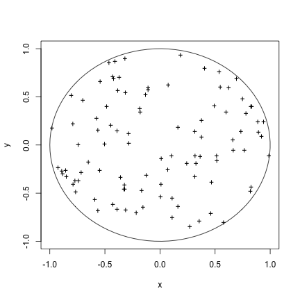 


Clean up again. 

```r
rm(th, w, z)
```


Quit the R program. You will be asked if you want to save the R workspace, and for an exploratory session like this, you probably do not want to save it.

```r
q()
```

